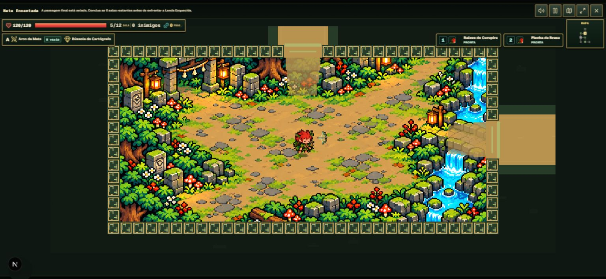
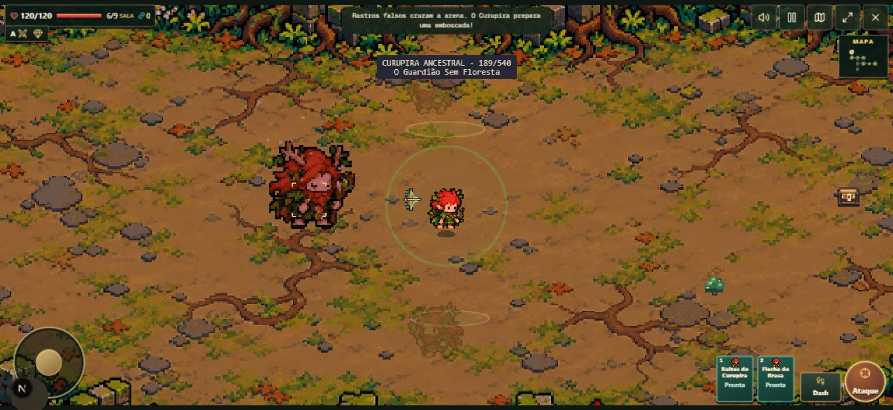
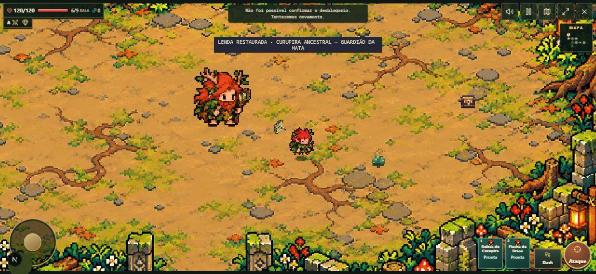
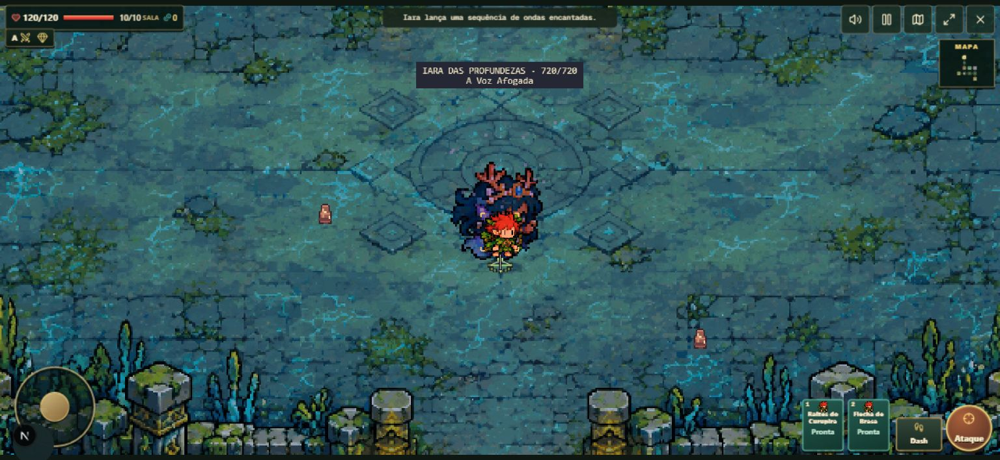
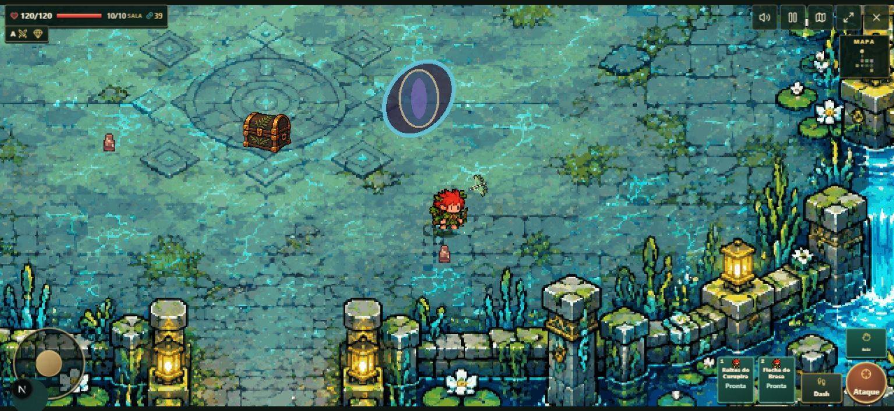
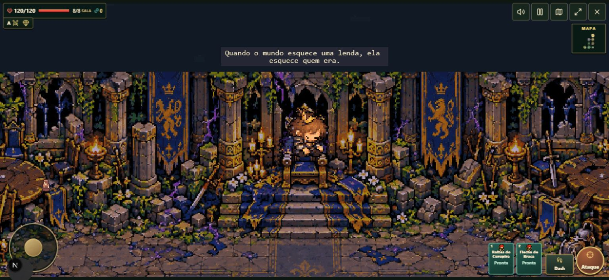
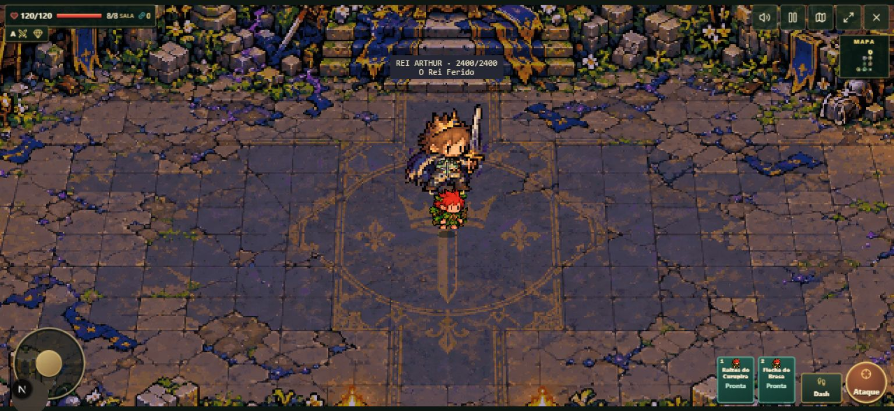
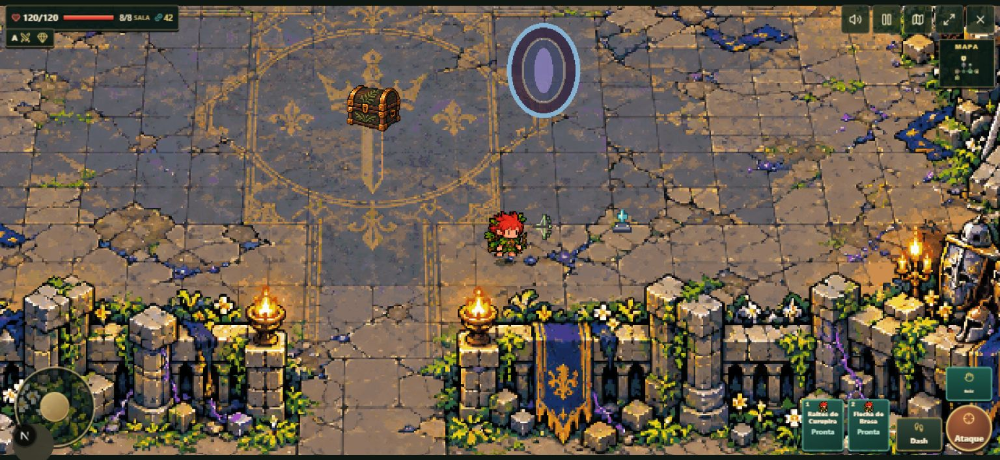

# Correção das arenas, HUD e pós-boss — 10/10/2026

Branch: `fix/boss-room-art-hud-post-clear`, a partir de `main` (`725b2e2`).
Sem deploy, merge ou mudança em `vercel.json`. Este passe não depende do PR #14.

## Causas e correções

1. `RESTORED` era considerado lock cinematográfico. O recibo de persistência
   atrasado ou com erro mantinha os controles bloqueados após a animação.
   Agora o fim visual libera input/câmera e restaura a paleta da arena; unlock,
   recompensa e conclusão continuam dependendo da confirmação. O recibo tem
   timeout/retry e callbacks antigos são ignorados.
2. O golpe final de um projétil podia destruir seu próprio body no callback
   de overlap. O callback depois chamava `setVelocity` no body destruído,
   lançando uma exceção e interrompendo a atualização do jogo. Isso foi
   reproduzido no navegador. A correção recicla os projéteis sem destruir bodies
   durante a iteração; o cleanup final ocorre na atualização da Scene.
3. O selo dos pré-requisitos reabria a mesma conexão que o encontro tentava
   fechar. Agora respeita o estado de combate da sala, incluindo a espera do
   recibo em RESTORED. Só CLEARED abre a saída.

`BossEncounterCompletion` concentra a finalização idempotente: runtime null,
ator removido, título/VFX/hazards/projéteis limpos, player parado, câmera seguindo,
sala/procedural concluídos, portas abertas, um portal, checkpoint e HUD.

## Arte e interface

Arquivos principais alterados:

| Área | Arquivos |
| --- | --- |
| Cenário e assets | `boss-room-art.ts`, `boss-room-presentation.ts`, `boss-presentations.ts`, `assets.ts`, `dungeon-world.ts`, `room-tilemap.ts` e as três `arena.webp` |
| Remoção da decoração geométrica | `bosses/regional-presentation.ts`, `bosses/king-arthur/presentation.ts`, `components/arpg/boss-encounter-view.tsx` |
| HUD e mensagens | `arpg-game.tsx`, `arpg-toast.tsx`, `arpg.css`, `globals.css`, `arpg-raid-arena.tsx` |
| Pós-boss | `boss-encounter-runtime.ts`, `cinematic-input-lock.ts`, `boss-encounter-completion.ts`, `dungeon-scene.ts`, `projectile-recycling.ts` |
| Autoridade e porta | `server/arpg/boss-progress.ts`, `dungeon/boss-access.ts`, `dungeon/combat-authority.ts`, `raid/engine.ts` |
| Regressões | `boss-post-clear.test.ts`, `boss-room-art.test.ts`, `projectile-recycling.test.ts`, `boss-progress.test.ts`, `boss-access.test.ts`, `boss-coop-state.test.ts`, `arpg-toast.test.tsx`, `arpg-game.test.tsx` |

Três backgrounds originais, 1952 × 992 (61 × 31 tiles), lossless, 128 cores,
pixels lógicos 2 × 2: clareira do Curupira, templo da Iara, Camelot de Arthur.
O centro permanece livre; árvores, totens, estátuas, ruínas, trono, Távola,
armaduras e estandartes são desenhados nos assets. Graphics fica restrito aos
VFX. A arte pertence ao mundo, não ao runtime removido após a restauração.

`boss-room-art.ts` declara imagens, overlays/props opcionais, colisões invisíveis,
spawn e trono. Phaser e co-op usam a mesma arte. Colisões e trono são consumidos
pelos motores, com fallback para o footprint dos saves antigos. Prompts,
exportação reproduzível e licença estão nos documentos de assets.

A topbar saiu do gameplay. Cinco controles flutuantes de 44 px (40 px em
paisagem baixa) respeitam safe areas. O toast é não interativo, aria-live polite,
até duas linhas, 2,5 s (mensagens críticas 4 s), com fade. Nome/fase/HP do boss
ocupam duas linhas compactas. A intro conserva seu título temporário.

## QA real no navegador local

Viewport **1536 × 708**, touch emulado. Canvas observado: **1536 × 691,2**,
posição **0 × 8,4**; usa 97,6% da altura disponível. O tamanho permaneceu igual
com toast visível e após expirar. Nenhuma `.arpg-shell__topbar` no DOM; cinco
controles. Minimapa e mapa modal funcionaram; joystick e ataque touch responderam.

Foi usado `?debugDungeon=1&bossQA=1` para acelerar a chegada ao boss e habilitar
invulnerabilidade de inspeção. Isso existe somente em development/offline.
Portanto este relatório comprova o ciclo jogável dos encontros, não uma run
normal completa de todas as salas sem auxílio.

| Boss | Entrada e combate | Pós-boss e extração |
| --- | --- | --- |
| Curupira | Intro, controles travados, ataques reais e habilidades nas três fases; golpe final com projétil | HP zero → purificação → RESTORED; movimento com save pendente/erro → retry → CLEARED, ator/runtime removidos → baú → portal → resultado da run |
| Iara | Primeira intro, tentativa de mover bloqueada; ataque touch reduziu HP; fases finais aceleradas pelo helper | Purificação, movimento por joystick/teclado em RESTORED, save com falha/retry, sala cleared/zero atores, baú e extração pelo portal |
| Arthur | Intro de 7 s, sentado no trono/levantando/espada, combate e fases finais aceleradas; reduced motion ativo | Ajoelhar sem morte, purificação, movimento em RESTORED, confirmação/cleanup, baú e extração; repetição de intro curta/skip e regressão da porta |

Injeção de teste: `bossSaveDelayMs=5000&bossSaveFailures=1` atrasa o save local e
faz a primeira tentativa falhar, sem substituir a gravação real. Exemplo:
Arthur em RESTORED tinha `cinematicLocked=false` e o player moveu de x=3591 para
x=3693. Após a confirmação, `bossEncounter=null`, `enemiesActive=0`, room cleared,
porta aberta/body desativado e um portal separado do baú.

O save local real terminou com arrays únicos:

```json
{
  "purifiedBossIds": ["ancestral-curupira", "deep-iara", "king-arthur"],
  "unlockedLegendIds": ["curupira", "iara", "king-arthur"],
  "seenBossIntroIds": ["ancestral-curupira", "deep-iara", "king-arthur"]
}
```

O reteste após as correções não registrou novo erro de console. O log anterior
da exceção de projétil foi preservado como evidência do bug encontrado.

## Screenshots reais, sem recomposição

Antes: topbar e canvas menor, no baseline anterior à correção.



Depois: Curupira, terceira fase com HUD compacta.



Curupira restaurado, jogador livre durante a confirmação.



Iara em combate e arena após cleanup, com baú e portal.




Arthur no trono, em combate e após a finalização.





## Verificação automatizada e limites

`npm run typecheck` e `npm run lint`: aprovados, sem warnings do lint.
`npm test`: **605 testes em 116 arquivos**, todos aprovados.
`npm run build`: aprovado (Next.js/webpack, TypeScript, páginas e pacote offline).
`git diff --check`: aprovado. Regressões
cobrem locks RESTORED, save rejeitado/pendente/atrasado, câmera, cleanup único,
remoção de ator, portas/portal, todos os bosses, reciclagem do último projétil,
arte/colisões, ausência de geometria ambiental, toasts e HUD. A suíte existente
também cobre layouts, thresholds, intro/skip, migração, persistência idempotente,
co-op de dois/quatro participantes e PostgreSQL via PGlite.

Co-op foi validado por simulação autoritativa e testes SQL/UI, incluindo movimento
em uma party de quatro jogadores em RESTORED sem vitória/unlock prematuros. Não houve lobby
online com contas/dispositivos reais neste passe. Não houve QA em aparelho físico
nem playtest de balanceamento sem invulnerabilidade. Nenhum deploy foi feito.
